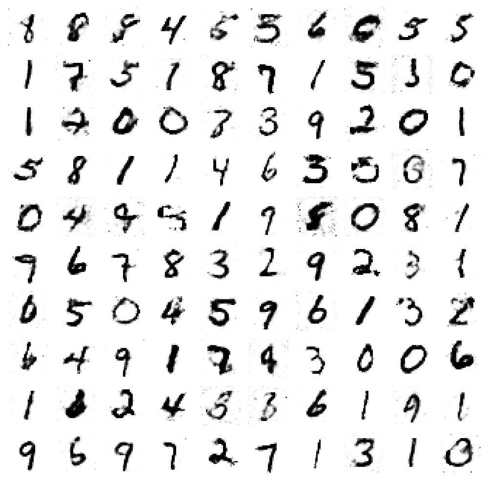

# Запускаем генерацию лиц в OpenVINO

Репозиторий моделей Open Model Zoo библиотеки OpenVINO содержит большое 
количество разных глубоких нейронных сетей, но в нем пока нет модели, которая 
могла бы генерировать правдоподобные изображения лиц. 
Давайте разберемся с OpenVINO и с запуском моделей для генерации лиц и его помощью.

## Совсем немного про GAN сети

Генеративно-состязательные сети (GAN) при хорошем обучении позволяют создавать 
изображения, которые будут восприниматься как реальные, а не синтезированные. 
GAN сети находят все большее применение в разных задачах:

- составление описания по картинке;
- генерация картинки по описанию;
- создание эмоджи по фотографии;
- увеличение разрешения изображений;
- перенос стиля изображений;
- улучшение качества медицинских изображений;
- генерация лиц и многое-многое другое.

Последнюю из этого списка задачку мы и попытаемся решить с помощью GAN сетей. 
Наиболее продвинутой моделью генерации лиц, что мне попадались, является 
[styleGAN](https://github.com/NVlabs/stylegan). 
Результаты и правда впечатляют:


Оригинальная модель styleGAN требует наличия видеокарты от NVIDIA для запуска, 
что к сожалению нам не подходит.  
Однако на просторах GitHub была найдена аналогичная модель, которая также 
генерирует лица и при этом может работать без GPU - 
[https://github.com/rosinality/style-based-gan-pytorch](https://github.com/rosinality/style-based-gan-pytorch?files=1).
Именно ее мы и возьмем в качестве модели для конвертации в OpenVINO.

Но для начала потренируемся на --кошках-- цифрах, чтобы удостовериться, что
OpenVINO умеет в GAN сети. 

## Генерация изображений цифр с помощью GAN

Сразу замахиваться на styleGAN мы не решили, а для начала обучили небольшую 
модельку на Keras, которая будет генерировать цифры, подобные цифрам в наборе 
MNIST. 
Использование стандартных слоев позволит точно запуститься в OpenVINO и получить
результат даже в том случае, если styleGAN окажется нам не по зубам.
Сетка настолько маленькая и простая, что ее возможно обучать даже на бюджетной
видеокарте NVIDIA своего ноутбука.

Исходный код для обучения и запуска GAN сети по генерации цифр на Keras можно 
найти здесь:
[https://github.com/alexmasterdi/Dnn/tree/GAN](https://github.com/alexmasterdi/Dnn/tree/GAN).

Модель, сконвертированная в формат OpenVINO и код для ее запуска в OpenVINO 
доступны здесь: 
[https://github.com/itlab-vision/OpenVINO-GAN-DEMO](https://github.com/itlab-vision/OpenVINO-GAN-DEMO).
Модель весом всего в 5 мегабайт генерирует вот такие цифры.


## Конвертация модели styleGAN в формат OpenVINO

Конвертацую моделей в формат OpenVINO можно производить из нескольких базовых 
форматов: Caffe, Tensorflow, ONNX и т.д. Чтобы запустить модель из PyTorch, мы 
сконвертируем ее в ONNX, а из ONNX уже в OpenVINO. Кстати, на практике оказалось, 
что конвертацию моделей Keras->ONNX->OpenVINO неподготовленным людям сделать 
намного проще, чем Keras->TensorFlow->OpenVINO.

```bash
# Code for model conversion here
```

После того, как мы сконвертировали модель, нужно реализовать код для запуска 
модели в фреймворке OpenVINO.
Простейший последовательный вариант кода выглядит следующим образом:

```python
# OpenVINO GAN code
```
И командная строка для запуска

```bash
# Run command line
```

Данный вариант кода будет работать с высокой производительностью, однако все же 
не раскроет всей мощи вашего процессора в задаче генерации 
лиц. Если же тема производительности заинтересует читателей, мы сделаем 
продолжение, в котором разберемся с оптимизацией запуска и утилизацией мощи 
процессора на 100%.
